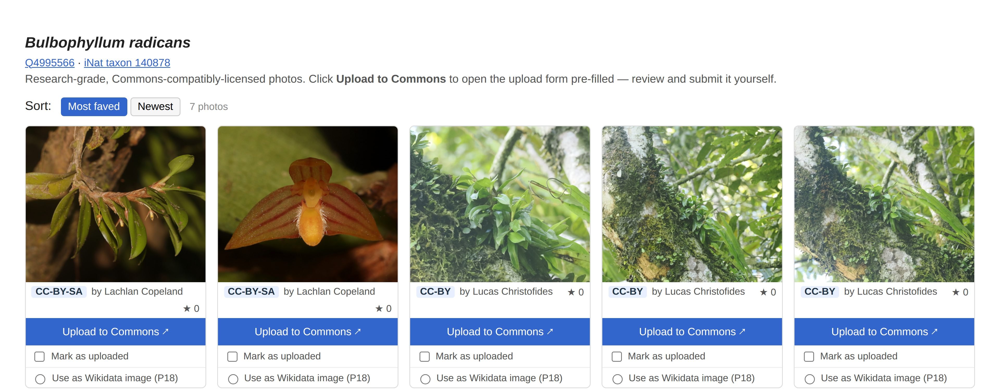
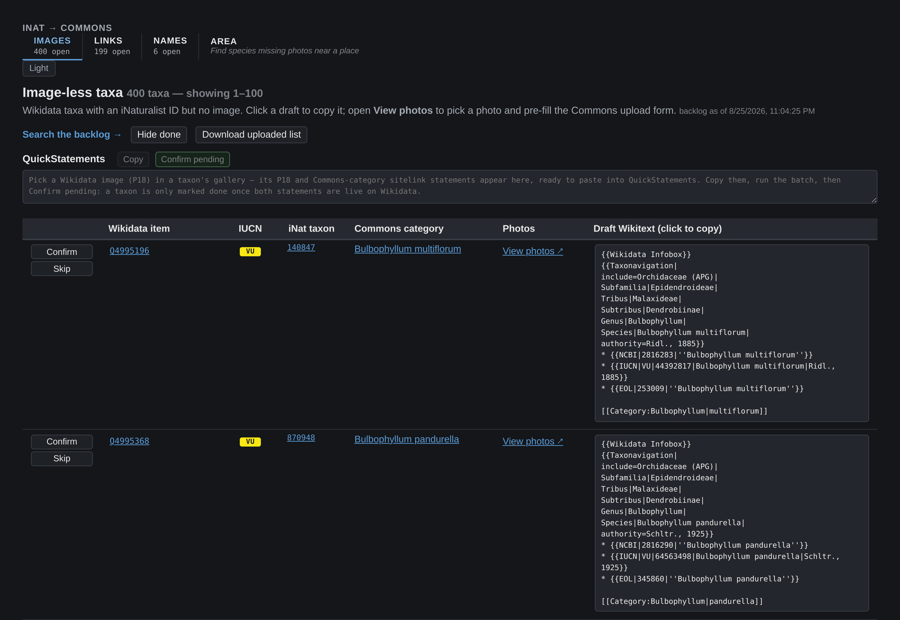
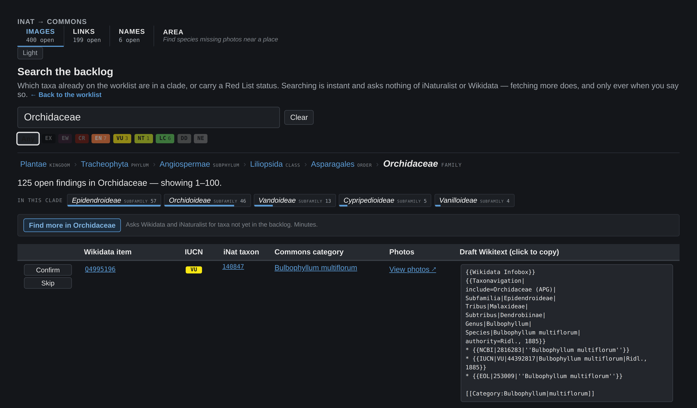
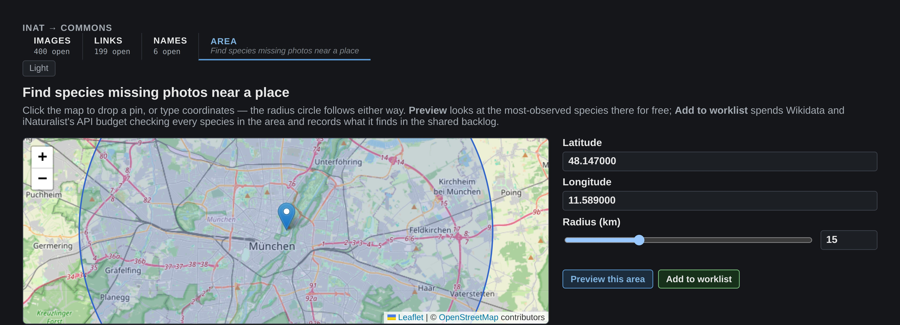

# wikidata-inat-checker

[](https://github.com/Livia-Rasp/wikidata-inat-checker/actions/workflows/ci.yml)
[](.nvmrc)
[](LICENSE)

Finds Wikidata taxon items that are missing an image, a vernacular name or an iNaturalist link,
and hands you the exact Wikitext or QuickStatements each fix needs.

> **Built with AI pair-programming.** The architecture, the SPARQL inversion, the
> confirm-before-done design and the threat model are mine.



<sub>Photos of *Bulbophyllum radicans* by Lachlan Copeland (CC BY-SA) and Lucas Christofides
(CC BY), via iNaturalist. Shown here as the app renders them.</sub>

## Impact

| | |
|---|---|
| **1.4M** | active iNaturalist taxa indexed locally, as SQLite |
| **1,043** | Wikidata taxon items reconciled against that index so far |
| **400** | image gaps found that can actually be closed: a CC-licensed photo exists |
| **643** | checked and ruled out. No Commons-compatible licence, so they never reach the worklist |
| **428** | of the taxa checked carry an IUCN threat category |
| **284** | unit tests, 85% line coverage, zero dev dependencies |

Nothing is marked done because a human said so. The app queues the edits and you run them. The
server then asks live Wikidata whether both halves landed, the image (P18) and the Commons
category sitelink. Only then does a finding close.

<sub>Figures from the author's own findings database, August 2026.</sub>

## Quick start

Node.js 26+. The SQLite index uses the built-in `node:sqlite` module, so there is no native build
step. `.nvmrc` pins the version (`nvm use`).

```sh
git clone https://github.com/Livia-Rasp/wikidata-inat-checker.git
cd wikidata-inat-checker
npm install

npm run images -- --limit 200 --iucn EN   # find 200 Endangered taxa that have no image
npm run web                               # work through them at http://localhost:8080
```

The first command fills the backlog. The second is where the work happens: pick a photo, upload it
to Commons through a pre-filled form, queue the Wikidata edits, confirm they landed. Re-run the
first whenever the worklist runs low.

> **First run downloads data.** The first checker that needs the taxon index fetches
> iNaturalist's open-data taxon dump (~189 MB) and builds a ~236 MB SQLite index in
> `~/.cache/wikidata-inat-checker/`. That takes a couple of minutes, once. Every run afterwards
> reads it locally. The dump is refreshed every 30 days.

Seven runtime dependencies, no dev dependencies, no build step. Renovate holds every release for
two weeks before proposing it, then merges non-major bumps itself once the tests and the container
smoke test pass. See the
[dependency policy](docs/threat-model.md#dependency-policy).

## How it works

iNaturalist publishes its full taxon dump as open data. This builds it into a local SQLite index,
then reconciles that index against Wikidata over batched SPARQL.

The reconciliation is inverted on purpose. The obvious query, "every Wikidata taxon with an iNat
ID but no image", runs to millions of rows and the public query service times out scanning it. So
the query goes the other way: take known values from the local index and ask Wikidata about those,
in batches. Everything stays inside both APIs' published rate budgets.

Findings accumulate in `data/findings.db` instead of being overwritten each run, so a backlog
survives across runs and across tools.

## Tools

| Tool | Command | Output | Documentation |
|---|---|---|---|
| Image checker | `npm run images` | `data/findings.db`, `output/drafts.html` | [docs/images.md](docs/images.md) |
| Verification | `npm run verify` | prunes the backlog, re-renders reports | [docs/images.md](docs/images.md#verification) |
| Vernacular names | `npm run names` | `output/names.html` | [docs/names.md](docs/names.md) |
| iNat links | `npm run links` | `output/links.html`, `output/links-ambiguous.html` | [docs/links.md](docs/links.md) |
| Area checker | `npm run area -- --lat <lat> --lng <lng> --radius <km>` | `output/area.html`, and the shared backlog | [docs/area.md](docs/area.md) |
| Category draft | `npm run draft -- <QID> [<QID> …]` | draft printed to stdout | [docs/images.md](docs/images.md#generating-a-single-category-draft) |
| Upload app | `npm run web` | the `web/` app at localhost:8080 | [docs/commons-upload.md](docs/commons-upload.md) |

The image, names and links checkers take `--limit <n>` and `--iucn <code>` (`CR`, `EN`, `VU`, …);
the image checker also takes `--taxon <name|iNat id>` to scope a run to one clade. The `--` after
`npm run <tool>` is required so npm forwards the flags to the script.

```sh
npm run images -- --limit 500 --iucn CR   # 500 Critically Endangered taxa
npm run images -- --taxon Orchidaceae     # orchids only (the taxon and its iNat descendants)
npm run links  -- --limit 1000 --iucn EN  # 1000 Endangered taxa
```

Reports land in `output/`, cross-run caches in `cache/`, and the image checker's accumulated
backlog in `data/findings.db`. All three are gitignored and created on first run. Clearing
`output/` and `cache/` is safe; **`data/` is not** — it is the only record of what has been
found and worked through.

## The upload app

Run the image checker at least once so the findings database has a backlog, then:

```sh
npm run web                     # http://localhost:8080
DISCOVER_ENABLED=1 npm run web  # …and allow discovery from the app
TOPUP_ENABLED=1 DISCOVER_ENABLED=1 npm run web  # …and a daily scheduled top-up
```

A [Fastify](https://fastify.dev) server (`server/`) serves the app and the findings API over the
same database the checkers write. It binds `127.0.0.1` by default — exposing it on a network is a
deliberate act (`HOST=…` plus `ALLOW_REMOTE_WRITES`, and `ALLOWED_HOSTS` too, or the write guard
refuses every confirm under a hostname it does not recognise). The threat model, every header, and
the full list of environment variables are in [docs/threat-model.md](docs/threat-model.md).

Nothing is uploaded or edited automatically: the app hands you a pre-filled Commons upload form
and a QuickStatements batch, and you submit both yourself.

### Worklist (`index.html`)

The image-less taxa, 100 rows at a time: Wikidata item, IUCN status, iNat taxon, Commons
category, a **View photos ↗** link and the draft category Wikitext (click to copy). Per row,
**Confirm** checks live Wikidata and **Skip** removes the taxon from the backlog for good. At
the top sit the **QuickStatements** panel for picked photos, **Confirm pending**, and
**Download uploaded list**.



### Taxon gallery (`taxon.html`)

One taxon's research-grade, Commons-compatibly-licensed (CC0 / CC BY / CC BY-SA) iNaturalist
photos, sortable by **Most faved** or **Newest**. **Upload to Commons ↗** opens `Special:Upload`
pre-filled with the file URL, license, filename and a full description — an `{{en|…}}` description
naming the taxon and place, a `{{Taken on}}` date, geographic categories along a taxon axis and a
place axis, and the photographer's Commons category where one exists. **Mark as uploaded** records
what you submitted; **Use as Wikidata image (P18)** picks that photo for the item and queues its
two QuickStatements. Details: [docs/commons-upload.md](docs/commons-upload.md).

### Backlog search (`search.html`)

Type a clade or an iNat id and the page answers with the taxon's position in the tree, what its
slice of the backlog holds one rank down, and the matching rows. Ancestors widen the search, the
clades under it narrow it, and the nine Red List chips compose with either. The query is in the
URL, so a search is linkable and Back steps through it. Searching is a read — it asks nothing of
iNaturalist or Wikidata.



With `DISCOVER_ENABLED=1` the page also gains **Find more**, which runs a discovery scoped to
whatever you just searched — the same work `npm run images` does, in a forked child, with progress
and a cancel that keeps what it already found. It is offered, never automatic, and refused from
anything but a local connection: a run spends your Wikidata and iNaturalist API budget for minutes
at a time.

With `TOPUP_ENABLED=1` too, the server also runs an unscoped top-up on its own, once a day,
preferring whichever hour tends to see the least traffic to this app. Off by default; the full
picture is in [docs/threat-model.md](docs/threat-model.md).

### Area picker (`area.html`)

Click a map to drop a pin, or type coordinates — the radius circle follows either way. **Preview**
is a free read: it looks at the most-observed species near the point and shows which lack a
Wikidata image, filling in photos and the latest observation date per row as they load. **Add to
worklist** is the one control that spends anything: it runs the same scoped discovery as Search's
**Find more**, checking every species in the area rather than just the sample Preview shows, and
records what it finds into the shared backlog.



### Confirming

Nothing is marked done because you said so. Copy the QuickStatements batch, run it, then press
**Confirm pending** (or a row's **Confirm**): the server asks live Wikidata and marks the taxon
done only if **both** the image (P18) and the Commons-category sitelink are there. Otherwise the
row stays on the worklist and says which half is missing.

## Running it in a container

```sh
docker compose up --build     # then open http://localhost:8080
```

The image runs the server only. It bind-mounts `./data`, so the container and your host share one
database: run `npm run images` on the host and the new findings appear without a restart. The
published port is bound to the host's loopback, so `docker compose up` does not put an
unauthenticated API on your network.

**If `id -u` gives you something other than 1000**, start it as yourself instead — a bind mount
keeps the host's ownership, so the container has to run as whoever owns `./data` or it exits with
"unable to open database file":

```sh
WINC_UID=$(id -u) WINC_GID=$(id -g) docker compose up --build
```

Two limits worth knowing. **"Find more", and the area page's Preview and Add to worklist, do not
work from the host browser** — all three are privileged routes requiring a request from the
server's own machine, and through a published port the container sees the bridge gateway instead;
fill the backlog with the CLI, which is what it is for. And the
**iNaturalist taxa index is not in the image**: ~236 MB of derived data that only the CLI may
build. Without it the app still serves everything, with search falling back to name matching
rather than failing.

CI publishes the image to `ghcr.io/livia-rasp/wikidata-inat-checker` on every push to `main`,
tagged `latest` and by commit sha. Note that GHCR packages start out private even for a public
repository, so pulling it needs authentication until that package's visibility is switched to
public by hand.

Redeploying it automatically and backing the database up are the next slice — see
[docs/findings-db-roadmap.md](docs/findings-db-roadmap.md).

## Project structure

- **Entry scripts** (`check*.js`, `draftCategory.js`) at the repository root, alongside the `Dockerfile`, `compose.yaml`, `.dockerignore` and `renovate.json5` — the entry scripts are what `npm run …` invokes.
- **`lib/`** — shared core and domain logic (Wikidata/Commons/iNat helpers, the SQLite taxa index, the findings store, Commons wikitext generation).
- **`report/`** — the HTML report builders.
- **`server/`** — the Fastify app behind `npm run web`.
- **`web/`** — the browser upload app (plain HTML/JS/CSS, no build step).
- **`test/`** — unit tests (`npm test`, Node's built-in runner — no dev dependencies, no network).
- **`tools/`** — repo maintenance. `npm run screenshots` regenerates the images in this README from the running app, so they cannot quietly fall out of date.
- **`output/`, `cache/`, `data/`** — generated artifacts (gitignored, created on first run).

## Documentation

Each tool has a page of its own (linked from the table above). Beyond those:

| Document | What it covers |
|---|---|
| [dev.md](docs/dev.md) | Module wiring, the SQLite taxa index, the findings store, discovery and search, the SPARQL and CirrusSearch patterns, Commons Taxonavigation rules — the implementation reference. |
| [threat-model.md](docs/threat-model.md) | What the server defends against and why each header, limit and validation rule is set the way it is — including what is deliberately *not* done. An engineering design record, not a disclosure policy. |
| [findings-db-roadmap.md](docs/findings-db-roadmap.md) | The plan of record for restructuring the checkers around a persistent database: the ordered slices, the schema, the decisions and the ones that were reversed during the build. |
| [commons-integration.md](docs/commons-integration.md) | App-agnostic recipes for Commons, iNaturalist and Wikidata — upload prefill, category discovery, reverse geocoding, author categories. Written to be reusable outside this project. |
| [commons-upload.md](docs/commons-upload.md) · [commons-upload-dev.md](docs/commons-upload-dev.md) | The upload app: what it does, and the research and design record behind it. |

## License

MIT — see [LICENSE](LICENSE). The upload logic in `web/js/commonsUpload.js` is adapted from
[inat2wiki](https://github.com/lubianat/inat2wiki); see [web/README.md](web/README.md) for the
full credit and the OpenStreetMap attribution.
