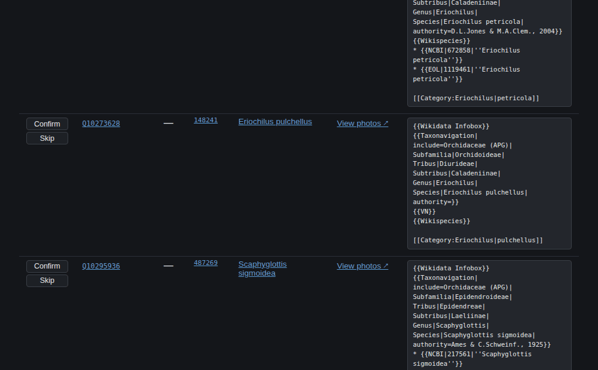

# wikidata-inat-checker

[](https://github.com/Livia-Rasp/wikidata-inat-checker/actions/workflows/ci.yml)
[](.github/workflows/ci.yml)
[](.nvmrc)
[](LICENSE)
[](https://github.com/Livia-Rasp/wikidata-inat-checker/pkgs/container/wikidata-inat-checker)

Finds Wikidata taxon items that are missing an image, a vernacular name or an iNaturalist link,
and hands you the exact Wikitext or QuickStatements each fix needs.

> **Built with AI pair-programming.** The architecture, the SPARQL inversion, the
> confirm-before-done design and the threat model are mine.

<picture>
  <source media="(prefers-color-scheme: dark)" srcset="docs/screenshots/gallery-dark.jpg">
  
</picture>

<sub>Photos of *Bulbophyllum radicans* by Lachlan Copeland (CC BY-SA) and Lucas Christofides
(CC BY), via iNaturalist. Shown here as the app renders them.</sub>

## Impact

| | |
|---|---|
| **1.4M** | active iNaturalist taxa indexed locally, as SQLite |
| **1,043** | Wikidata taxon items reconciled against that index so far |
| **400** | image gaps found that can actually be closed: a CC-licensed photo exists |
| **643** | checked and ruled out. No Commons-compatible licence, so they never reach the worklist |
| **428** | of the taxa checked carry an IUCN threat category |
| **316** | unit tests, 88% line coverage, zero dev dependencies |

Nothing is marked done because a human said so. The app queues the edits and you run them. The
server then asks live Wikidata whether both halves landed, the image (P18) and the Commons
category sitelink. Only then does a finding close.

<sub>Figures from the author's own findings database, August 2026.</sub>

## Quick start

Node.js 26+. The SQLite index uses the built-in `node:sqlite` module, so there is no native build
step. `.nvmrc` pins the version (`nvm use`).

```sh
git clone https://github.com/Livia-Rasp/wikidata-inat-checker.git
cd wikidata-inat-checker
npm install

npm run images -- --limit 200 --iucn EN   # find 200 Endangered taxa that have no image
npm run web                               # work through them at http://localhost:8080
```

The first command fills the backlog. The second is where the work happens: pick a photo, upload it
to Commons through a pre-filled form, queue the Wikidata edits, confirm they landed. Re-run the
first whenever the worklist runs low.

> **First run downloads data.** The first checker that needs the taxon index fetches
> iNaturalist's open-data taxon dump (~189 MB) and builds a ~236 MB SQLite index in
> `~/.cache/wikidata-inat-checker/`. That takes a couple of minutes, once. Every run afterwards
> reads it locally. The dump is refreshed every 30 days.

Seven runtime dependencies, three dev-only (typecheck + lint tooling), no build step. Renovate
holds every release for two weeks before proposing it, then merges non-major bumps itself once the
tests and the container smoke test pass. See the
[dependency policy](docs/threat-model.md#dependency-policy).

## See it work

The whole loop: pick a taxon off the worklist, choose one of its CC-licensed iNaturalist photos as
the Wikidata image, watch the two QuickStatements appear, then confirm.



The confirm in that recording is real. It asks live Wikidata whether both the image (P18) and the
Commons-category sitelink are there, and only then does the row leave the backlog. The recording is
generated by `npm run record`, which picks a taxon whose edit is genuinely complete so the check
passes honestly rather than being stubbed.

## How it works

iNaturalist publishes its full taxon dump as open data. This builds it into a local SQLite index,
then reconciles that index against Wikidata over batched SPARQL.

The reconciliation is inverted on purpose. The obvious query, "every Wikidata taxon with an iNat
ID but no image", runs to millions of rows and the public query service times out scanning it. So
the query goes the other way: take known values from the local index and ask Wikidata about those,
in batches. Everything stays inside both APIs' published rate budgets.

Findings accumulate in `data/findings.db` instead of being overwritten each run, so a backlog
survives across runs and across tools.

## Tools

| Tool | Command | Output | Documentation |
|---|---|---|---|
| Image checker | `npm run images` | `data/findings.db`, `output/drafts.html` | [docs/images.md](docs/images.md) |
| Verification | `npm run verify` | prunes the backlog, re-renders reports | [docs/images.md](docs/images.md#verification) |
| Vernacular names | `npm run names` | `data/findings.db`, `output/names.html` | [docs/names.md](docs/names.md) |
| iNat links | `npm run links` | `data/findings.db`, `output/links.html`, `output/links-ambiguous.html` | [docs/links.md](docs/links.md) |
| Area checker | `npm run area -- --lat <lat> --lng <lng> --radius <km>` | `output/area.html`, and the shared backlog | [docs/area.md](docs/area.md) |
| Category draft | `npm run draft -- <QID> [<QID> …]` | draft printed to stdout | [docs/images.md](docs/images.md#generating-a-single-category-draft) |
| Upload app | `npm run web` | the `web/` app at localhost:8080 | [docs/commons-upload.md](docs/commons-upload.md) |

The image, names and links checkers take `--limit <n>` and `--iucn <code>` (`CR`, `EN`, `VU`, …).
The image checker also takes `--taxon <name|iNat id>` to scope a run to one clade, so
`npm run images -- --taxon Orchidaceae` reaches orchids and their iNat descendants only.

Reports land in `output/`, cross-run caches in `cache/`, and the accumulated backlog in
`data/findings.db`. All three are gitignored and created on first run. Clearing `output/` and
`cache/` is safe. **`data/` is not.** It is the only record of what has been found and worked
through, and nothing can reconstruct it.

## The upload app

A [Fastify](https://fastify.dev) server (`server/`) serves the app and the findings API over the
same database the checkers write. It binds `127.0.0.1` by default. Putting it on a network takes
three deliberate settings, not one: `HOST`, `ALLOW_REMOTE_WRITES` and `ALLOWED_HOSTS`. Without the
third the write guard refuses every confirm under a hostname it does not recognise. Every header
and environment variable is in [docs/threat-model.md](docs/threat-model.md).

```sh
npm run web                                      # http://localhost:8080
DISCOVER_ENABLED=1 npm run web                   # …and allow discovery from the app
TOPUP_ENABLED=1 DISCOVER_ENABLED=1 npm run web   # …and a daily scheduled top-up
```

Nothing is uploaded or edited automatically. The app hands you a pre-filled Commons upload form
and a QuickStatements batch, and you submit both yourself.

Six pages, sharing one nav: the **worklist**, a **links worklist** (with an ambiguous/conflict
review section), a **names worklist**, one taxon's **photo gallery**, a **backlog search** scoped
to any clade, and an **area picker** that finds image-less taxa near a point on a map. What each
page does, and the
full confirm loop, is in [docs/commons-upload.md](docs/commons-upload.md).

## Running it in a container

```sh
docker compose up --build                                   # then open http://localhost:8080
docker pull ghcr.io/livia-rasp/wikidata-inat-checker:latest # or take the published image
```

The image runs the server only, and bind-mounts `./data` so the container and your host share one
database. `docker compose up` also brings up a second, read-only container over the server's
rotated logs — an MCP server exposing six log-query tools to Claude Code or any MCP client, so
debugging a deployed instance doesn't mean reconstructing a `jq` pipeline from scratch each time.
See [docs/logging.md](docs/logging.md) and [docs/mcp-server.md](docs/mcp-server.md). CI builds,
starts and smoke-tests both images before publishing. Details, including what still needs the
CLI: [docs/container.md](docs/container.md).

## Project structure

- **Entry scripts** (`check*.js`, `draftCategory.js`) at the repository root, which is what `npm run …` invokes
- **`lib/`** — Wikidata/Commons/iNat helpers, the SQLite taxa index, the findings store, Commons wikitext generation
- **`report/`** — the HTML report builders
- **`server/`** — the Fastify app behind `npm run web`
- **`web/`** — the browser upload app, plain HTML/JS/CSS, no build step
- **`mcp-server/`** — a standalone, read-only MCP server over `server/`'s rotated logs; its own
  package, its own dependencies, no build step here either
- **`test/`** — unit tests on Node's built-in runner. No dev dependencies, no network
- **`tools/`** — repo maintenance. `npm run screenshots` and `npm run record` regenerate this README's images from the running app
- **`output/`, `cache/`, `logs/`, `data/`** — generated artifacts, gitignored, created on first run

## Documentation

Each tool has a page of its own, linked from the table above. Beyond those:

| Document | What it covers |
|---|---|
| [dev.md](docs/dev.md) | The implementation reference: module wiring, the taxa index, the findings store, discovery, search, the SPARQL and CirrusSearch patterns. |
| [threat-model.md](docs/threat-model.md) | What the server defends against and why, including what is deliberately *not* done. A design record, not a disclosure policy. |
| [logging.md](docs/logging.md) | What the server logs, and why — the dual stdout/rotated-file setup, correlation ids, `timed()` step tracing. |
| [mcp-server.md](docs/mcp-server.md) | The standalone MCP server that reads those logs: its six tools, its own threat model. |
| [container.md](docs/container.md) | Running the server (and the log-reading MCP server) in Docker, and what still needs the CLI. |
| [findings-db-roadmap.md](docs/findings-db-roadmap.md) | The plan of record for the persistent-database restructure: the slices, the schema, and the decisions that were reversed during the build. |
| [commons-integration.md](docs/commons-integration.md) | App-agnostic Commons/iNat/Wikidata recipes, written to be reusable outside this project. |
| [commons-upload.md](docs/commons-upload.md) · [commons-upload-dev.md](docs/commons-upload-dev.md) | The upload app: what it does, and the design record behind it. |

## License

MIT, see [LICENSE](LICENSE). The upload logic in `web/js/commonsUpload.js` is adapted from
[inat2wiki](https://github.com/lubianat/inat2wiki); see [web/README.md](web/README.md) for the
full credit and the OpenStreetMap attribution.
