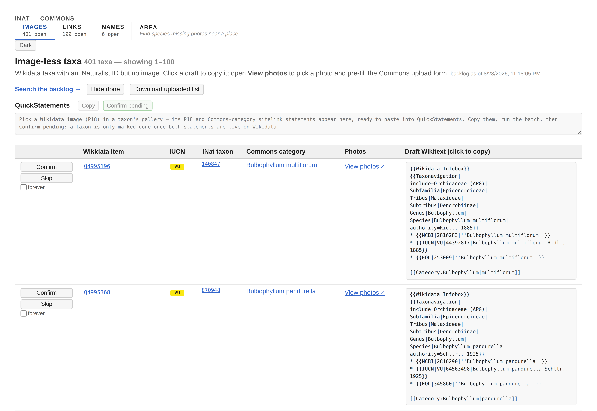
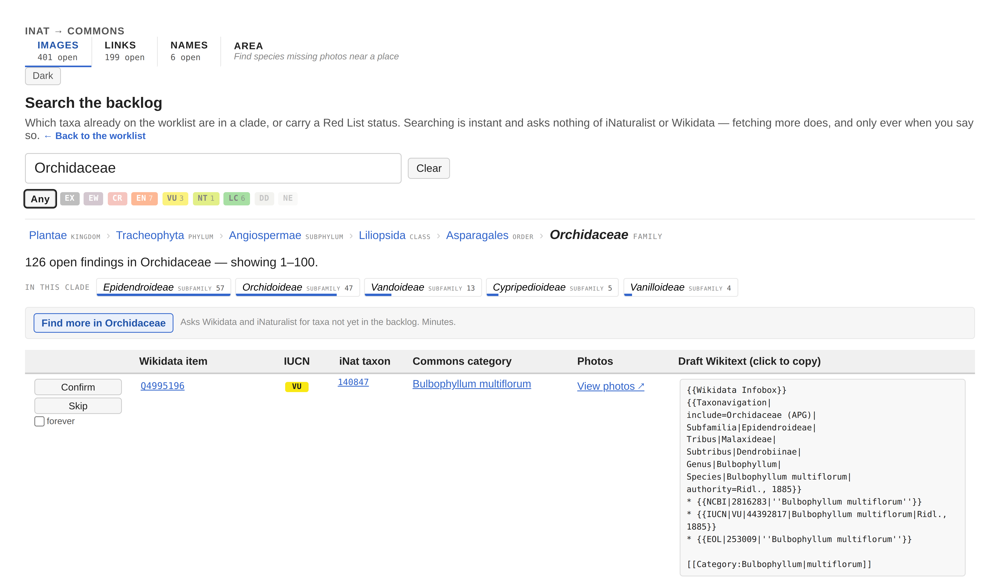
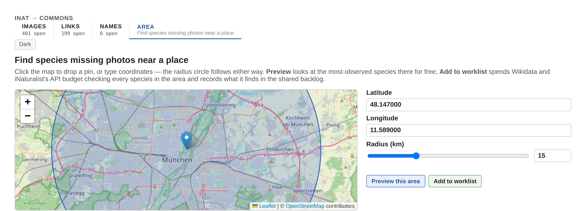
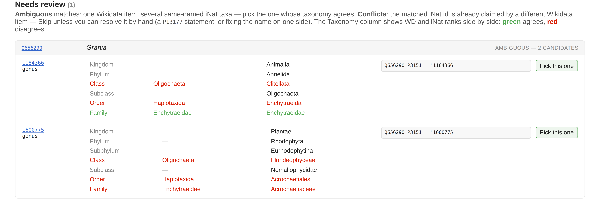
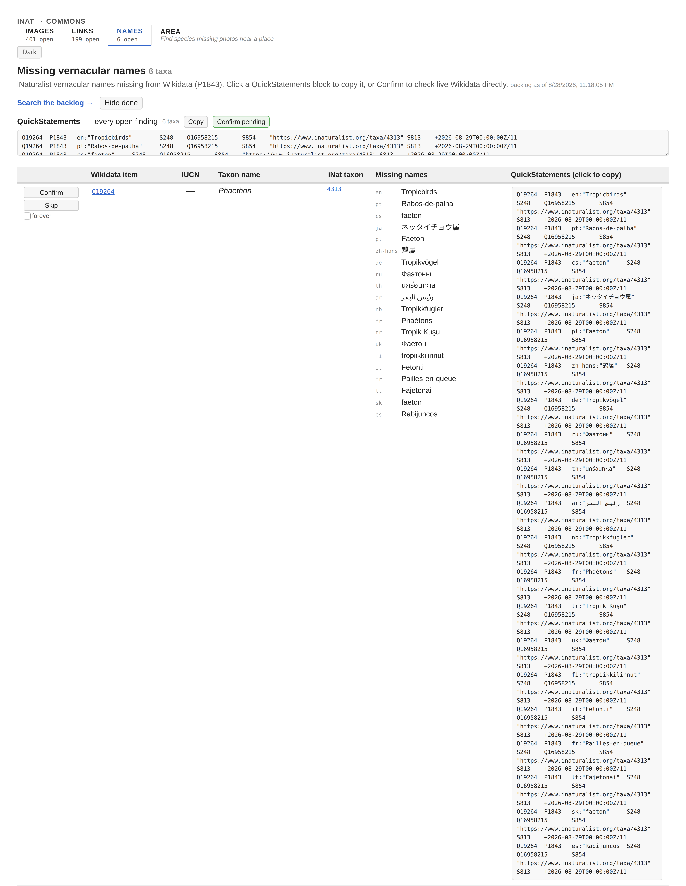
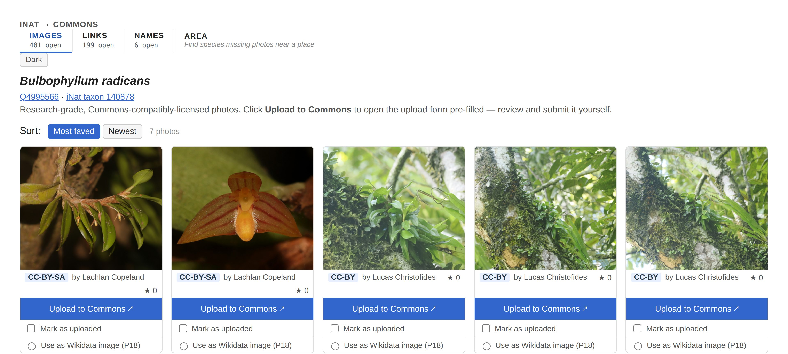

# iNaturalist → Commons upload app

An assisted upload step for the image pipeline. The image checker finds Wikidata taxa with
an iNaturalist ID but no image. This web app lets you browse those taxa, look at their
compatibly-licensed iNaturalist photos, and open the Wikimedia Commons upload form
**pre-filled** with everything needed: the file URL, license, filename, and a detailed,
ready-made description (see [What the file description contains](#what-the-file-description-contains)).
You review and submit the form yourself. **Nothing is uploaded automatically.**

The design rationale, the inat2wiki prior art it builds on, and the technical research
behind it are in the [design & research record](commons-upload-dev.md).

The screenshots below go stale the same way prose does whenever `web/` changes — see
[screenshots/README.md](screenshots/README.md) for how they're kept current.

<picture>
  <source media="(prefers-color-scheme: dark)" srcset="screenshots/worklist-dark.png">
  
</picture>

## Usage

```sh
node checkImages.js        # (or npm run images) — fills the findings database
npm run web                # serve the app at http://localhost:8080
```

Then open <http://localhost:8080/>:

1. **Main view** — a table of image-less taxa (Wikidata item, IUCN status, iNat taxon, Commons
   category, a photos link, draft category Wikitext), 100 rows at a time. Click a draft to copy
   it. Each row has **Confirm** (check
   live Wikidata and mark the taxon done if the edit is there) and **Skip** (never offer it again —
   permanent, and there is no un-skip in the UI). A **Download uploaded list** button exports what
   you've marked uploaded (see [Tracking uploads](#tracking-uploads)).
   **Search the backlog →** opens the search page.
1b. **Search** (`search.html`) — type a scientific name or an iNat id to see only that clade's part
   of the backlog, with its position in the tree above it and what it contains one rank below.
   Ancestors widen, the clades below narrow, and the nine Red List chips compose with either.
   When a clade is thin the page *offers* to fetch more of exactly it — and only ever on a click.

   <picture>
     <source media="(prefers-color-scheme: dark)" srcset="screenshots/search-dark.png">
     
   </picture>

1c. **Area** (`area.html`) — click a map (or type coordinates) to pick a point and a radius; the
   radius circle follows either way. **Preview** answers fast and for free: it looks at the
   most-observed species near the point and shows which lack a Wikidata image, with photos and
   the latest observation date filled in per row as they load. **Add to worklist** is the one
   control here that spends anything — it runs the same scoped discovery as Search's "Find more",
   checking every species in the area rather than just the most-observed sample, and records what
   it finds into the shared backlog above.

   <picture>
     <source media="(prefers-color-scheme: dark)" srcset="screenshots/area-dark.jpg">
     
   </picture>

1d. **Links** (`links.html`) — the same worklist shape as the main view, but for Wikidata taxa
   with a name and no iNaturalist link (P3151): Confirm checks live Wikidata for the P3151
   statement, and the QuickStatements panel collects the open matches whose taxonomy agrees
   confidently enough to trust unattended (the same bar `checkLinks.js --auto` uses). Below the
   worklist, a **Needs review** section handles what a name match alone can't: an **ambiguous**
   match (one Wikidata item, several same-named iNat taxa) shows every candidate's taxonomy next
   to Wikidata's, colour-coded, with **Pick this one** recording the choice; a **conflict** (the
   matched iNat id is already claimed by a different Wikidata item) shows the same comparison with
   only **Skip**, since resolving one is a judgement call outside the app. See
   [links.md](links.md) for the checker this page is a worklist over.

   <picture>
     <source media="(prefers-color-scheme: dark)" srcset="screenshots/links-dark.png">
     
   </picture>

1e. **Names** (`names.html`) — the same worklist shape again, for Wikidata taxa missing one or
   more iNaturalist vernacular names (P1843): Confirm checks live Wikidata for every proposed
   language, resolving the finding once all are live and trimming it to whatever's still missing
   if only some are. No review section — unlike links, a name candidate has no ambiguity to
   resolve, so the QuickStatements panel simply batches every open finding's missing-name
   statements automatically. See [names.md](names.md) for the checker this page is a worklist
   over.

   <picture>
     <source media="(prefers-color-scheme: dark)" srcset="screenshots/names-dark.png">
     
   </picture>

2. Click **View photos ↗** on a row to open that taxon's photo gallery in a new tab.
3. **Gallery** — all of the taxon's research-grade, Commons-compatibly-licensed
   (CC0 / CC BY / CC BY-SA) iNaturalist photos, with a **Most faved / Newest** sort toggle.

   <picture>
     <source media="(prefers-color-scheme: dark)" srcset="screenshots/gallery-dark.jpg">
     
   </picture>

4. Click **Upload to Commons ↗** under a photo. The Commons `Special:Upload` form opens
   pre-filled; review it and click Upload there. Then tick **Mark as uploaded** on the card.
5. On the photo you uploaded, tick **Use as Wikidata image (P18)** — exactly one photo per
   taxon. This records the file as the item's image and queues the taxon's QuickStatements on
   the main view (see [Adding P18 + category in batches](#adding-p18--category-in-batches)).

> To actually submit the upload you must be **logged in to Wikimedia Commons** (upload-by-URL
> requires a registered account). The app's job ends at handing you a correctly pre-filled
> form.

6. Copy the QuickStatements, run the batch, and press **Confirm pending**. Until that check
   passes, nothing is marked done — see [Confirming](#confirming-what-actually-landed).

The app reads the backlog live from the server, so there is nothing to regenerate; re-run the
image checker to *add* taxa to it.

## What the file description contains

The pre-filled file page is built to be comprehensive but not overloaded. For a photo it
produces wikitext like:

```wikitext
{{Information
|description= {{en|Red-bellied Woodpecker (''Melanerpes carolinus'') in Grayson, Texas, United States}}
|date={{Taken on|2023-02-21|location=United States}}
|source=https://www.inaturalist.org/photos/258148165
|author=[https://www.inaturalist.org/users/24783 Matt DeLozier]
|permission=
|other versions=
}}
{{Location|33.7147|-96.4892|source:iNaturalist|prec=15}}

{{iNaturalist|149781312}}

{{INaturalistreview}}
[[Category:Melanerpes carolinus]]
[[Category:Picidae of Texas]]
[[Category:Grayson County, Texas]]
```

Where each piece comes from:

- **Description** — `{{en|<English common name> (''Scientific name'') in County, State,
  Country}}`, from the observation's *identified* taxon (so a subspecies keeps its precise
  name) and its location. The common name is dropped when iNaturalist has none; the location
  uses whatever administrative levels resolve, and is dropped entirely if none do.
- **Date** — `{{Taken on|<observed date>|location=<Country>}}`, so the file is categorised by
  both date and country. (Falls back to a plain `{{Taken on|<date>}}` when no country.)
- **`{{Location}}`** — the observation's public coordinates, with `prec=<metres>` carrying
  the accuracy radius (`public_positional_accuracy`). Obscured records (threatened taxa, or a
  user's own geoprivacy setting) return a randomized point with a large radius (e.g. ~29 km),
  so `prec` records that the location is coarse rather than implying false precision.
- **`{{iNaturalist}}` + `{{INaturalistreview}}`** — link the source observation and flag the
  file for the Commons license-review bot.
- **Species category** — `[[Category:<Taxon>]]` for the taxon you're sourcing the image for.
- **Geographic categories** — up to two, capturing **two independent axes** so a photo is
  filed as specifically as possible on both:
  - a **taxon-in-place** category — the most *taxon*-specific existing one (e.g.
    `Picidae of Texas`, `Odonata of Argentina`, `Fabaceae in Hawaii`); the place falls back to
    a coarser level when a finer one has no category. Both prepositions (`of`/`in`) are tried,
    plants/animals/fungi map to `Flora`/`Animals`/`Fungi`, and soft redirects (e.g.
    `Plants of Hawaii` → `Flora of Hawaii`) are followed so images never land in a redirect.
  - a **most-specific location** category — the finest *place* available, as
    `Flora/Fauna/Fungi of <place>` if that exists, else `Nature of <place>` (the all-organisms
    category, e.g. `Nature of Pasco Department`), else the plain place category named the way
    Commons does (a county is `Grayson County, Texas`, a town `Williston, Vermont` — never the
    bare iNat name, which would hit an unrelated page). The finest place comes from iNat's
    `place_ids` plus an OpenStreetMap (Nominatim) reverse-geocode of the coordinates, which
    adds the municipality/town level (and any missing county) iNat lacked.
  - **No redundancy:** if one of the two is a subcategory of the other (e.g. the taxon-in-place
    category already sits at the finest place), only the more specific is kept; otherwise both
    are added. Each is emitted only when a real category exists.
- **Author category** — if the photographer has a Commons category, it's added too. It's
  discovered from the iNaturalist user ID via Commons' `{{Inaturalist user}}` template and
  Wikidata's *iNaturalist user ID* property (P12022) — so it currently matches only the
  handful of photographers who have such a category.

All of the location/category lookups are cached in your browser, so repeated photos and
re-visits are fast.

## Tracking uploads

The app cannot tell whether an upload actually went through. It only opens the Commons form in a
new tab. So after you submit a file, tick **Mark as uploaded** on its card. The card gets an
"uploaded" badge and the file is recorded in the findings database, so it survives a cleared
browser profile and the checkers can see it. The main page's **Download uploaded list** button
exports the set as JSON (`{ "exported": …, "uploaded": [ "<filename>", … ] }`).

> Every file also gets the tracking category `Media uploaded with wikidata-inat-checker`, so
> Commons can see what this tool has contributed. It was deliberately withheld while the tool was
> private and unknown, and **switched on 2026-08-20**, the day after the repository went public.
> Files uploaded before that do not carry it — the uploaded-files list is what lets them be
> back-filled.

## Adding P18 + category in batches

Uploading the file to Commons still leaves two edits on the **Wikidata** item: setting the
image (**P18**) and linking the Commons category. The app collects these into a
[QuickStatements](https://quickstatements.toolforge.org) batch so you can apply many at once
instead of editing items one by one.

- In a taxon's gallery, ticking **Use as Wikidata image (P18)** on the uploaded photo records
  that file as the item's image. Only one photo per taxon can be picked (the database enforces
  it); it also marks the photo uploaded. It does **not** mark the taxon done — that is what
  confirming is for.
- The main view has a **QuickStatements** panel at the top. For every taxon with a picked
  image, it emits two tab-separated commands:

  ```
  Q10444353	P18	"Cedarbergeniana imperfecta - 15895773.jpg"
  Q10444353	Scommonswiki	"Category:Cedarbergeniana imperfecta"
  ```

  The first sets the image; the second adds the **Commons-category sitelink** (the
  "Other sites" / Multilingual Sites link — not the P373 statement). The category is the
  taxon's own name; the filename is the one the upload form used.
- Click **Copy**, paste into the QuickStatements *Import* box, and run the batch. The picks stay
  in the panel. They are cleared by **confirmation**, not by copying, because confirmation is the
  point at which the edit is known to exist. Copying used to clear them, which meant a batch you
  never actually pasted left no trace of what it was supposed to do.

The panel is built in the browser from the picks you make, which are stored in the findings
database; nothing is submitted to Wikidata automatically.

## Confirming what actually landed

**A taxon is never marked done because you said so.** Copying QuickStatements is not evidence
that you pasted them, and a batch can apply one statement and not the other. So the app asks
Wikidata instead.

Press **Confirm** on a row, or **Confirm pending** for everything you have picked, and the
server reads the live item through the Action API (never SPARQL, whose lag would show your own
edit as missing seconds after you made it). The finding becomes `done` only when **both** the
image (P18) and the commonswiki sitelink are there. Otherwise it stays on the worklist and says
which half is missing, which is usually the useful part.

A confirm that fails changes nothing, and re-running it is safe. A QuickStatements batch can sit
queued for a while. If Wikidata itself cannot be reached you get a "try again" rather than a false
answer. Use **Skip** for a taxon that will never have a Commons category, since it would otherwise
never confirm.

## How it fits together

- `checkImages.js`, `checkLinks.js` and `checkNames.js` record findings in `data/findings.db`,
  `kind='image'`, `kind='link'` and `kind='name'` respectively; the server serves them as
  `GET /api/findings?kind=…` — the only link between the core tools and the app.
- The app is six pages sharing one persistent nav (`web/js/shell.js`), which carries a
  per-workflow open count and a dark/light toggle:
  - **`index.html`**, the image worklist.
  - **`links.html`**, the link worklist plus the ambiguous/conflict review section (`POST
    /findings/:id/pick` for ambiguous, `Skip` for conflict — see [links.md](links.md)).
  - **`names.html`**, the names worklist — no review section, since a name finding has no
    ambiguity to resolve (see [names.md](names.md)).
  - **`taxon.html`**, one taxon's photos.
  - **`search.html`**, the backlog search: which clade a finding is in, what a clade holds, and a
    scoped discovery started from a button (`GET /api/search?kind=…`, `POST /api/discover`, both
    kind-aware — `?kind=link` from `links.html`'s search link, or `?kind=name` from `names.html`'s,
    searches that backlog the same way the default searches images).
  - **`area.html`**, a vendored Leaflet map (`web/vendor/leaflet/`) over the same discovery
    pipeline, scoped by `{lat, lng, radius}` instead of a clade, plus its own free preview
    (`GET /api/discover/area`, read-only, no findings recorded). Image-only — neither links nor
    names has an area scope.

  All four table pages (`index.html`, `links.html`, `names.html`, `search.html`) render their
  rows through the same `web/js/rows.js`, which dispatches by the finding's `kind`.
- **Discovery is one job runner, shared by kind.** `POST /discover` takes an optional `tool`
  (`'images'` default, `'links'`, `'names'`), dispatched in the forked child to `lib/discover.js`,
  `lib/discoverLinks.js` or `lib/discoverNames.js`; only one discovery run — of any of the three
  kinds — can be in flight at a time. The scheduled top-up (`TOPUP_ENABLED`) tries each kind once a
  day, in that order, sharing the same scope config and the same slot.
- The `web/` app has **no build step**, just plain HTML/JS/CSS. It reads the open backlog from
  `GET /api/findings`. From the browser it queries the iNaturalist API (photos, places, taxon
  ancestry), Commons (category existence, author categories), and the Wikidata Query Service
  (author categories), all of which are CORS-open. It then builds the Commons upload URL
  client-side.
- `npm run web` runs the Fastify server in `server/`, which serves both `web/` and that API from
  `data/findings.db`. It binds `127.0.0.1` by default; see [threat-model.md](threat-model.md) for the
  threat model and the environment variables.
- `web/` still has no code dependency on the rest of the repo beyond that one HTTP contract. That
  boundary was originally kept so the app could be spun out into its own repository; **the spin-out
  was dropped as theoretical** when the Fastify backend landed, and the boundary is now worth
  keeping only because it stays cheap. See [commons-upload-dev.md](commons-upload-dev.md) for the
  architecture and [findings-db-roadmap.md](findings-db-roadmap.md#decisions) for that decision.

## Attribution

The upload logic (the `Special:Upload` prefill URL and file-page wikitext in
`web/js/commonsUpload.js`) is adapted from [inat2wiki](https://github.com/lubianat/inat2wiki)
by Tiago Lubiana (@lubianat), which credits kaldari's *iNaturalist2Commons*. See
[web/README.md](../web/README.md) for the full credit.
